# Project 3 - RENT.ART

## Description
This third project was a full-stack group project. We decided to develop a website that would allow customers to rent artwork from the online gallery to their homes. Who wouldn't be thrilled to have the privilege, for a short period, to own a unique masterpiece and to proudly display it in their living room? Have all the time to admire these artworks without having to queue in a museum?

## Deployment link
https://artrent-6d502dba1723.herokuapp.com/

## Packages to install
React, React-router-dom, Bootstrap, React Bootstrap, Sass, Node, Axios, MUI, Vite, Bcrypt, Dotenv, Express, JWT (JSON Web Token), Mongoose

## Timeframe & Working Team
For this group project, I was teamed up with:
- Adam Rafferty (https://github.com/adraf/rentart) ; and 
- Antonio Climent (https://github.com/Nemomain/rentart).

We had 10 days to build this full-stack project 

## Technologies Used
HTML, CSS, JavaScript, React, Axios, Express, Node.js, Mongoose, MongoDB (Atlas), Vite, JSON, Bcrypt, JWT(Bearer Token), npm, Dotenv, Chrome DevTools, Bootstrap, MUI, SASS, Cloudinary, Heroku.

## Brief
### Technical Requirements
- Build a full-stack application by making your own backend and your own front-end
- Use an Express API to serve your data from a Mongo database
- Consume your API with a separate front-end built with React
- Be a complete product which most likely means multiple relationships and CRUD functionality for at least a couple of models
- Implement thoughtful user stories/wireframes that are significant enough to help you know which features are core MVP and which you can cut
- Have a visually impressive design to kick your portfolio up a notch and have something to wow future clients & employers. ALLOW time for this.
- Be deployed online so it's publicly accessible.

## Planning
The three of us shared our ideas for the project and we were all very enthusiastic about the rental art concept. Therefore, we quickly tackled the sign-off requirements. 

I took the lead in drawing the wireframe and then used the live collaboration functionality from Excalidraw to allow us to all contribute to the development of the multipage website. We defined some functionalities that would be developed throughout the project. For instance, multiple profiles will be created, allowing customers to access various functionalities:
- Public profile - anyone not logged in can browse through the collection
- Art appreciator profile 
    - needs to be registered
     - can flag personal favourites among the public collection
     - Can rent-out artwork
- Artist Profile 
    - same as ‘art appreciator’ +
    - Is allowed to upload their artwork to the public collection and will then be able to rent them out
- Admin profile 
    - Have the ability to manage, and update the collections and users

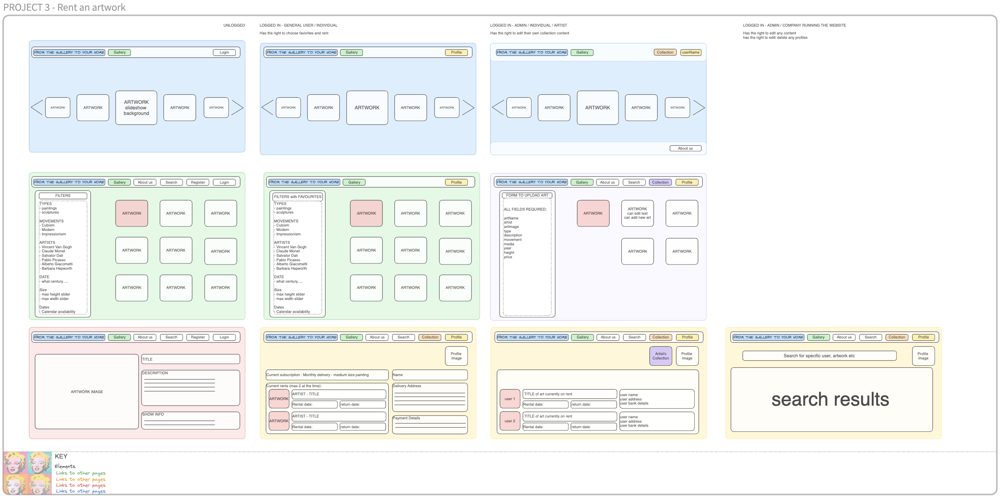

We then developed our ERD diagram to plan which models/resources are needed for the back-end application and what relationships are needed in between:

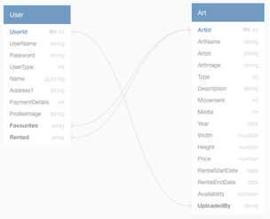

We were then ready for sign-off and started planning the work in Trello to manage progress and distribute tasks Adam Antonio and I

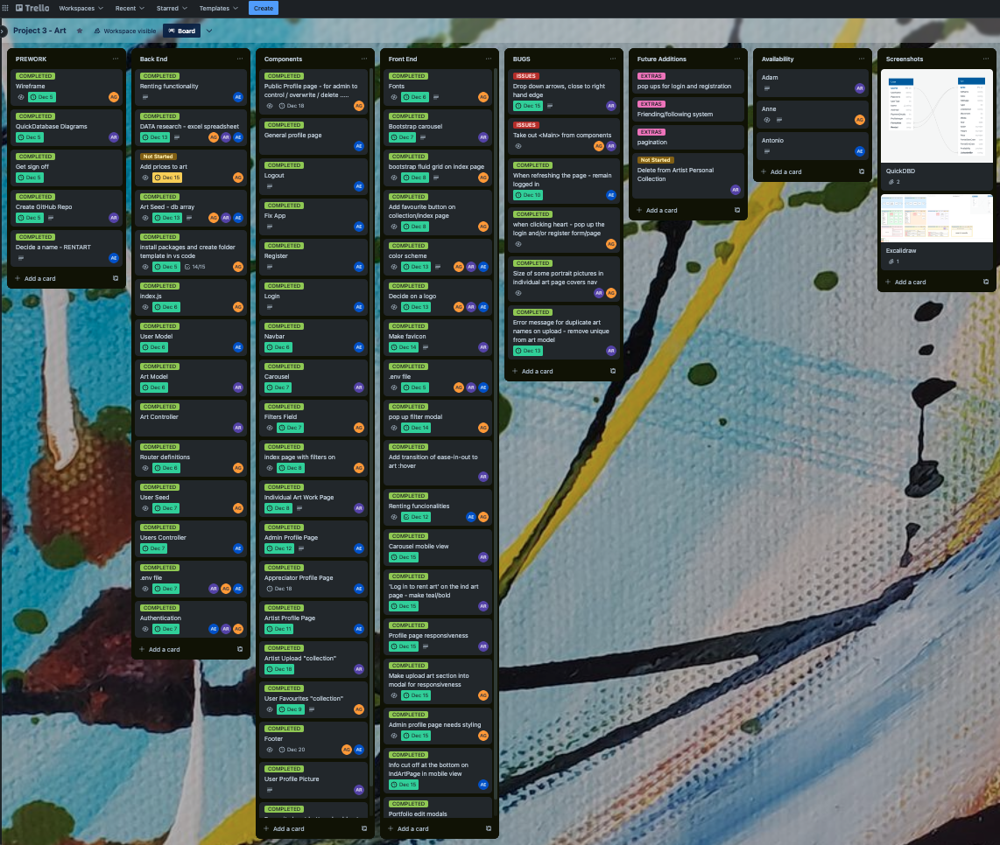

We used these labels to track progress 

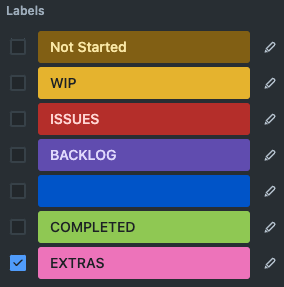

We made sure that all the tasks have a due date set up, which means that the alert button will automatically turn red if a task still needs to be completed by then. It also means that we can use the calendar power-up from Trello and navigate the task cards by date. These cards can then be dragged from one date to another, ensuring that no backlogs are left behind. It is also useful to visualize the workload per day/week and ensure that the weekly planning is realistic. These screenshots have been taken at the end of the project. This would have been a completely different picture.

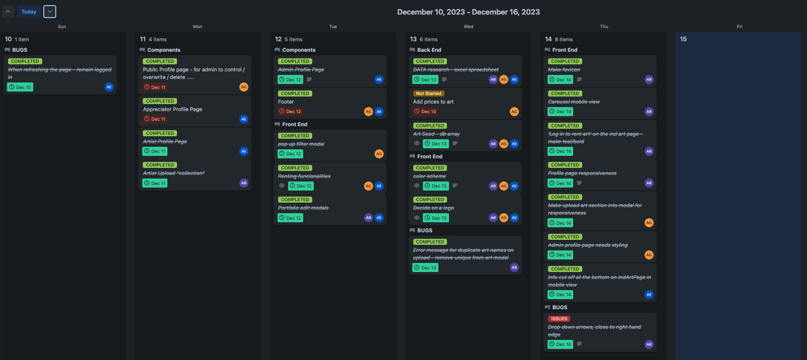 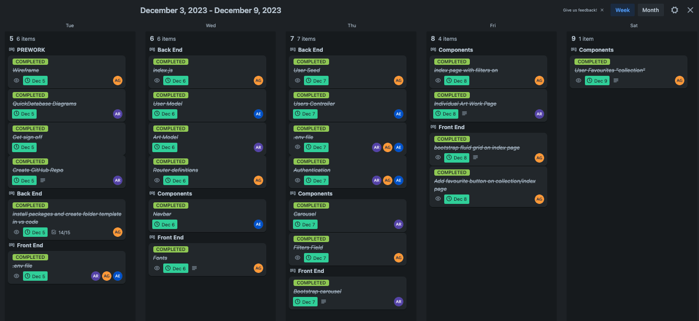

## Build/Code Process
Before collaborating on Github, by creating a development branch and various components branches, we worked on the main and set up the folders/files structure template with all the appropriate JSON packages needed. We used a random generator to choose who among us would be hosting the project on GitHub. Adam (the chosen one) then also created a development branch and added us as collaborators to his GitHub repository. Antonio and I cloned the project on our local computers. We all created specific branches to start developing specific parts of the application. Here are some of the branches that have been created:

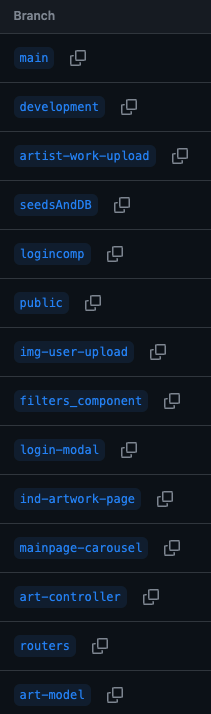

We started by building the bones of the backend:
- Adam and Antonio wrote the js files needed for the art and user models where the defined schemas follow the ERD diagram, they also wrote the controllers using these models and wrote the CRUD functions
- I wrote the routes.js, the secureRoute.js and the index.js that would bring the functions within the controllers together and enable rerouting them to the appropriate browser pages to follow our wireframe.
- I also wrote the seeds.js and added some minimal arts.js and users.js to start populating the database. On the latter, we all had to contribute to populate the database with various artwork.
- I created a Google sheet with a list of artworks that we wanted to include on our website and shared it with the team for collaboration. It also helped ensure that we don't have duplicates before adding the data to the seeds in VScode.

From day 2, we were ready to start working on the client side and developing the frontend, but we had to add up to the basic backend functionalities in parallel to our frontend progress
- My main focus is the index page that will host the public collection 
    - Make the grid display responsive
    - Add a modal for the filters that will pop up a list of options to filter the artwork
        - Text search for the artwork title
        - Dropdown search for the
            - Artist name
            - Movement	
            - Media used
        - Sliders to change the ranges for the width, height and prices
        - When a customer is logged in, they can add favourites, this brings an extra filter, to only display their favourites on the screen

    ```JavaScript
    {arts
        .filter(art => {
            const minWidth = artWidth[0]
            const maxWidth = artWidth[1]
            const minHeight = artHeight[0]
            const maxHeight = artHeight[1]
            const pattern = new RegExp(search, 'i')
            const isUserLoggedIn = userData && userData.token
            const userFavourites = isUserLoggedIn ? userData.favourites || [] : []
            const isFavorite = userFavourites.includes(art._id)
            const matchesFilter =
                (minWidth < art.width &&
                    art.width < maxWidth &&
                    minHeight < art.height &&
                    art.height < maxHeight &&
                    ((artistChoice === 'Artists' && movementChoice === 'Movements' && mediaChoice === 'Media')
                        || (art.artist.includes(artistChoice) && movementChoice === 'Movements' && mediaChoice === 'Media')
                        || (art.artist.includes(artistChoice) && art.movement.includes(movementChoice) && mediaChoice === 'Media')
                        || (art.artist.includes(artistChoice) && art.movement.includes(movementChoice) && art.media.includes(mediaChoice))
                        || (art.artist.includes(artistChoice) && movementChoice === 'Movements' && art.media.includes(mediaChoice))
                        || (artistChoice === 'Artists' && art.movement.includes(movementChoice) && mediaChoice === 'Media')
                        || (artistChoice === 'Artists' && art.movement.includes(movementChoice) && mediaChoice === 'Media')
                        || (artistChoice === 'Artists' && art.movement.includes(movementChoice) && art.media.includes(mediaChoice)))
                    && pattern.test(art.artName)
                    && (showFavoritesOnly ? isFavorite : true))
            return matchesFilter
        })
    ```

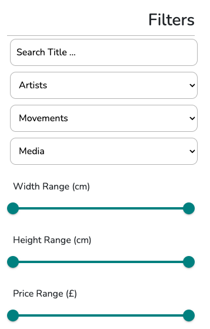

- In the meantime, Adam had done the layout and pulled the information needed from the backend to render the page regarding each artwork. 
    - Antonio wrote the logic of the ‘async rentArt’ function in the back-end within the arts.js controller and updated the ‘route.js’ file to assign it as .PUT method to the appropriate path. In summary, this function allows us to ensure that 
        - If an artwork exists and is available, it will toggle its availability to false for a week
        - It will also add this artwork _id to the ‘rented’ array in the specific user’s database 
    - I added a button to the individual artwork page set up by Adam that would allow the customers to rent the artwork. This button would call the function written in the back end by Antonio by awaiting a response to the path set to the ‘rentArt’ ‘function. I had to ensure that the headers held the correct Authorization Bearer to ensure that the customer was logged in and had clearance to rent the artwork. The message appearing on the button will also vary whether
        - The user is not logged in - “Login to rent art”
        - The artwork is not available (rented by another user) - “Not Available”
        - Available to rent - “Click to Rent”
        - Rented by the user, allowing the return of the artwork - “Return Art”

    ```JavaScript
    async function updateUserRented() {
        console.log('NEW LOG', artId, availableToRent, userData.token)
        try {
            const res = await axios.put(`/api/art/rent/${artId}`, { availability: !availableToRent }, {
                headers: {
                    Authorization: `Bearer ${userData.token}`,
                },
            })
            setavailableToRent(!availableToRent)
            setUserData({ ...res.data[1], token: userData.token })
        } catch (error) {
            console.error(error)
        }
    }
    ```

    ```JavaScript
    {(isUserLoggedIn) ?
        availableToRent ? <button
            className='rent-button'
            onClick={() => {
                updateUserRented()
            }}>
            Click to Rent
        </button> :
            userData.rented.includes(artId) ? (
                <button
                    className='rent-button'
                    onClick={() => {
                        updateUserRented()
                    }}>
                    Return Art
                </button>
            ) : (<p>Not Available</p>)
        :
        (
            <>
                <p className="logInMessage">Log in to rent art</p>
            </>
        )
    }
    ```

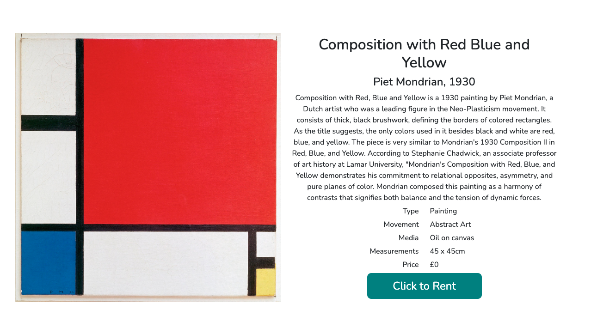

- I created the public profile page, so anyone can have access to information about other users and see what their favourite artwork is, or see their collections if they are artists.
- I added a modal to the collection page and wrote the JSX to display on the page the artists’ collection in a fluid grid using Bootstrap in the same manner as the index page - Adam wrote the component regarding the form and the functionalities for the artist to upload their artwork in the database
- I also reworked the style in Sass and updated the layout of the various profiles created by Antonio to keep them consistent and reused the bootstrap fluid containers to lay out the grids for each section (artist’s collection, artworks currently on rent and favourites). Each grid is responsive and the grid size adapts to the screen’s size

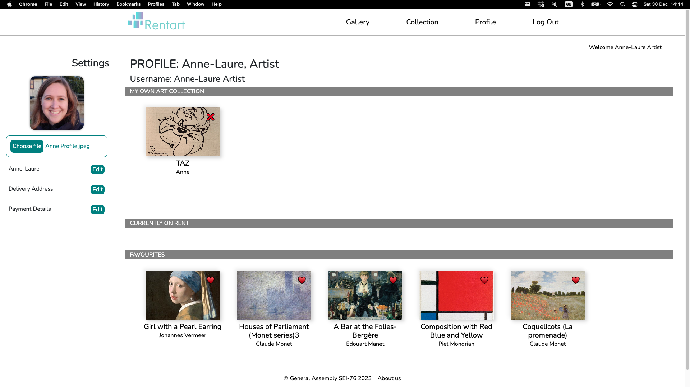
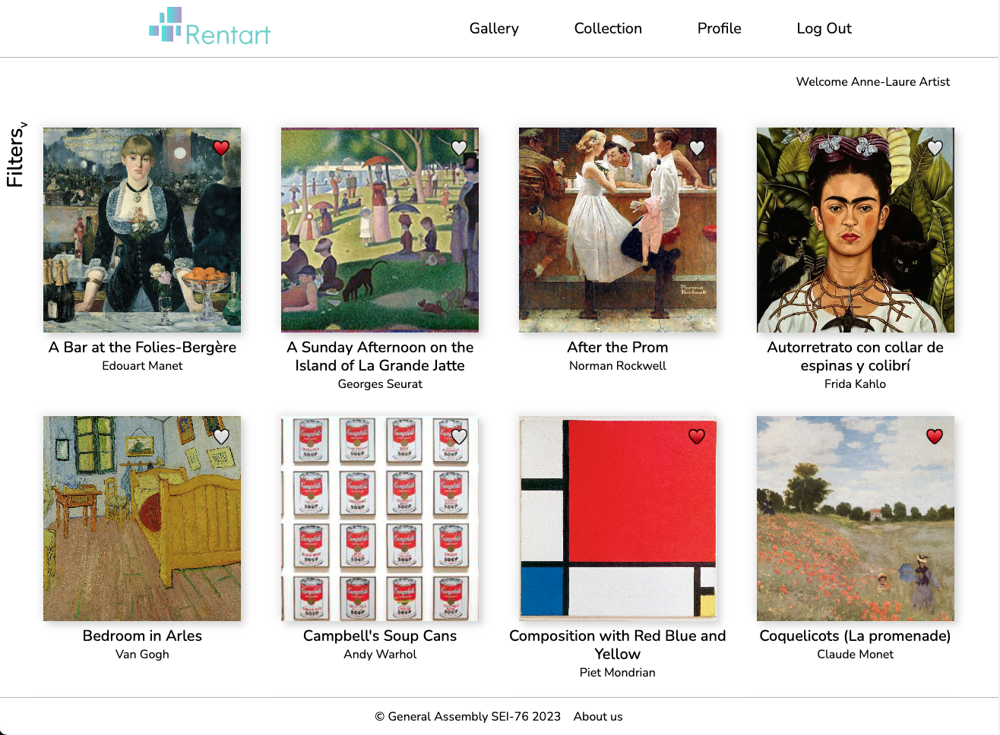

## Challenges
- Being logged out when refreshing the page, instead of localStorage, we used sessionStorage

    ```JavaScript
    let stage = sessionStorage.getItem('data')
    const [userData, setUserData] = useState(stage ? JSON.parse(stage) : '')
    ```

- Passing props when using Outlet from ‘react-router-dom’: we used the context property to do so 
    - In the app.jsx:
        ```JavaScript
        <Outlet context={[userData, setUserData]} />
        ```
    - In each component.jsx needing this data
        ```JavaScript
        const [userData, setUserData] = useOutletContext()
        ```
    - This solution seems simple but it gave us many issues at the time when trying to update the database and to have the props come through as intended
        ```JavaScript
        async function updateUserFavourites(newFavourite) {
            try {
                const res = await axios.put('/api/profile', { favourites: newFavourite }, {
                    headers: {
                        Authorization: `Bearer ${userData.token}`,
                    },
                })
                const newData = { ...res.data, token: userData.token }
                setUserData(newData)

            } catch (error) {
                console.log(error)
            }
        }
        ```

## Wins
- Filtering was more challenging due to the various combinations of filters to apply at the same time. We decided to implement three different types of drop-down options to filter in addition to a text search and three sliding bars filtering the artworks by size and price range.
- Updating the backend database when interacting with the front end
    - Populating the favourite array
    - Population the rented array

## Key Learnings/Takeaways
- Working through GitHub was a massive improvement for group collaboration and version control. 

## Bugs
- There were a few bugs left on the registration page on the presentation day, luckily we had a backup plan and had seeded a sufficient amount of fictive users part of the database. We were therefore able to demonstrate the various functionalities assigned to the four user types we created.
- As this is a major bug, we communicated through Slack on holiday to share our solutions to the bugs, and we redeployed a fixed version on our personal ‘Heroku’ individually.

## Future Improvements
- Add the ability for an artist to remove one of their artwork from the public collection 
    - I have added this function to my forked project after the presentation
- Add the ability to follow other users or specific artists (like on Instagram)
- Improve the look of the registration and login pages, to have them as modal popups

